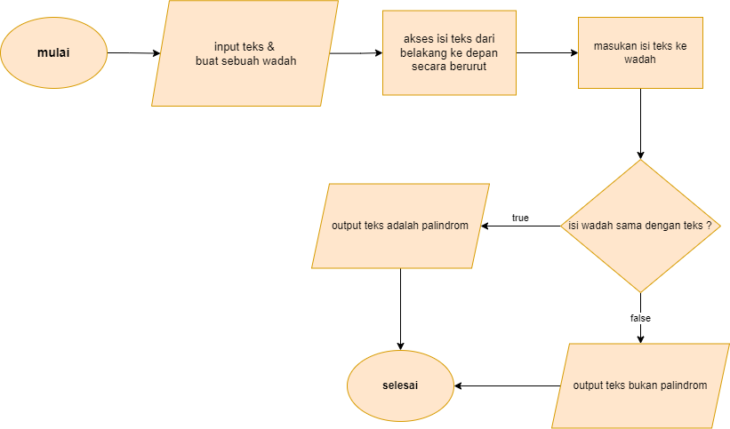

Tugas Algoritma & flowchart

1.cek palindrom
Cek palindrom diminta untuk mengecek sebuah kata jika dibalik hasilnya sama dengan sebelum kata itu di balik
Contoh:
“malam” jika dibalik tetap malam maka kata ini adalah palindrom
“javascript” jika dibalik maka menjadi tpircsavaj berarti kata ini bukan palindrom

#Algoritma
Memasukan input teks
Menyiapkan sebuah wadah untuk menyimpan teks
Mengakses isi teks mulai dari urutan belakang lalu disimpan kedalam wadah
Wadah kita bandingkan dengan teks
Jika isinya sama maka itu adalah sebuah palindrom

#flowchart

2.reverse word
Reverse word diminta hanya untuk membalikan sebuah kalimat
Contoh : kalimat “saya belajar javascript” dibalik menjadi “javascript belajar saya”

#Algoritma
Masukan input kalimat
Membuat 2 buah wadah untuk menyimpan kalimat wadah pertama bertipe string & yang kedua bertipe array
Akses kalimat tersebut sesuai urutan masukan kedalam wadah pertama bertipe string
Cek jika isi kalimat terdapat spasi kosong ,maka wadah bertipe string masukan ke wadah bertipe array dari depan
Kosongkan Kembali wadah bertipe string
Dan apabila isi kalimat adalah yang paling terakhir maka kita masukan isi kalimat ke wadah string lalu masukan ke wadah bertipe array
Ubah wadah array menjadi string
Output wadah ke dua (array)

#flowchart

